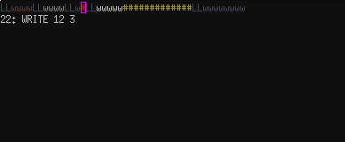
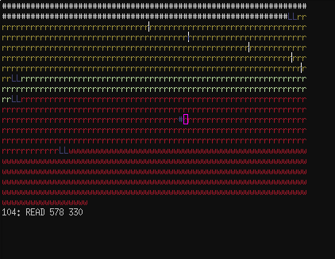
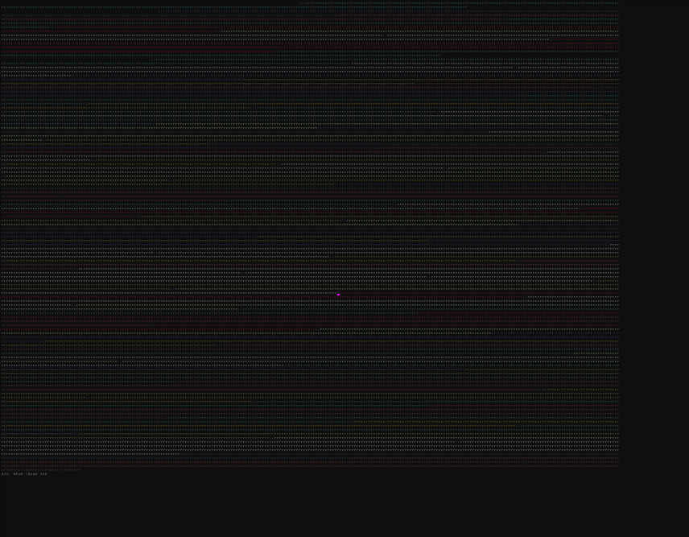

refrag
======

A memory management visualizer. This is good for debugging a toy/homework malloc or other memory manager without changing the code much. Just add lines such as the following to whatever your program's debug output thing is (it'll ignore any lines that don't match this format):

```
READ 0 124
FREE 0 124
WRITE 450 128
```

That's position and length in bytes (or sectors, or whatever you feel like). Then, run the following to visualize your log file:

```
git clone https://github.com/marcuswanner/refrag.git
cd refrag
python3 refrag.py writes-med.txt #or whichever log filename
```

## Ok cool, that's kind of neat

For CS 3114 at Virginia Tech, the final project involved creating a memory manager which essentially works like a primitive malloc(), and was specifically required to place new allocations in the best-fitting block. While debugging my implementation, I found it helpful to visualize logs of reads, writes, and frees. I wrote a python script that uses curses to display an animated, colorized, and annotated representation of memory during the execution of the memory manager under test.

## Screenshots







